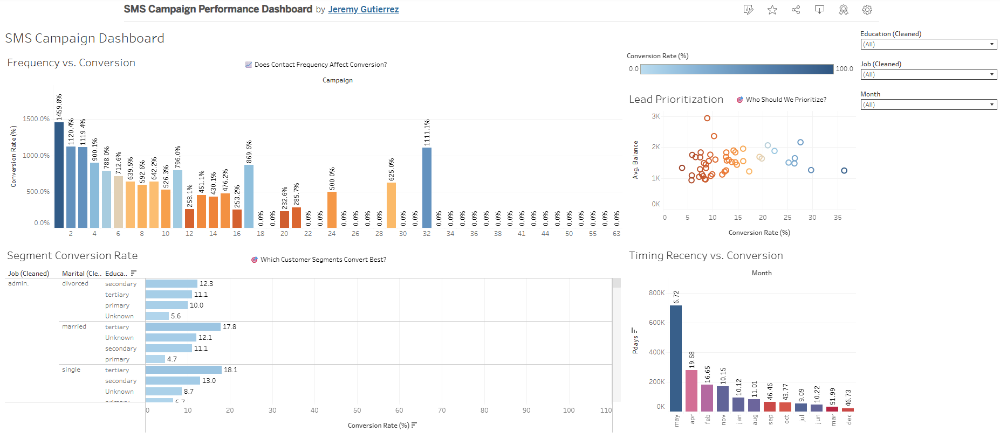

# 📲 SMS Campaign Performance Dashboard

### Analyzing lead conversion, contact strategy, and lead prioritization using SQL and Tableau.

This project investigates how customer demographics, contact frequency, and timing influence conversion rates in an SMS marketing campaign. All insights were derived using SQL and visualized through a professional Tableau dashboard designed for cross-functional decision-making.

---

## 🧾 Executive Summary

This dashboard addresses three strategic questions to help improve SMS marketing performance:

1. **Which customer segments respond best to SMS outreach messages?**
2. **How does the timing or frequency of contact affect conversion rate?**
3. **If we can only reach 20% of leads, who should we prioritize?**

### 📊 Dashboard Overview

- Visual insights include:
  - Segment-based conversion rates by job, marital status, and education
  - Conversion trends by contact frequency and time since last outreach
  - A lead prioritization matrix based on conversion probability and account value

> 🔗 [View the live dashboard on Tableau Public](https://public.tableau.com/views/SMSCampaignPerformanceDashboard/SMSCampaignDashboard?:language=en-US&:sid=&:redirect=auth&:display_count=n&:origin=viz_share_link) 



---

### ✅ Actionable Recommendations

- **Prioritize segments with high conversion rates**, especially blue-collar roles and those with past positive interactions.
  - *📣 Marketing Team Insight:* Refine audience targeting for future SMS campaigns using top-performing job and education segments.

- **Limit contact frequency to 3 or fewer attempts.** Conversion sharply declines after repeated outreach.
  - *🧠 Compliance/Operations Insight:* Helps prevent user fatigue and maintain regulatory compliance.

- **Use account balance and past engagement (`pdays`) to rank leads.**
  - *💰 Finance Team Insight:* Optimizes spend by focusing on customers with the best ROI potential.

- **Schedule outreach during strong-performing months** like May and August to increase conversion efficiency.
  - *📆 Sales & Campaign Ops Insight:* Coordinate campaign timing around seasonal effectiveness patterns.

---

## 🔍 Deep Dive: Analytical Approach

### 🧮 Dataset Overview
- ~41,000 records from a Portuguese bank’s direct marketing efforts
- Each record includes demographics, campaign behavior, and final subscription outcome (`Subscribed`)

### 💾 SQL-Based Analysis
- Used MySQL to calculate segment-level conversion rates
- Identified timing thresholds using `campaign`, `pdays`, and `previous` outreach values
- Built lead prioritization logic combining conversion rate with `balance`

### 📊 Tableau Visualizations
- **Bar charts:** Segment conversion breakdowns
- **Heatmaps:** Frequency and timing impact
- **Scatter plots:** High-value lead prioritization based on likelihood and customer value

---

## 🔗 Data Source

This dataset is publicly available via the [UCI Machine Learning Repository](https://archive.ics.uci.edu/ml/datasets/bank+marketing) and represents anonymized marketing data from a Portuguese banking institution.

---

## 🛠️ Tools Used

- **SQL (MySQL dialect):** Data transformation and insight generation
- **Tableau Public:** Executive dashboards and data storytelling
- **Python (Pandas):** Light preprocessing and CSV cleanup

---

## 📁 Repository Structure

```
sms-campaign-analysis/
│
├── data/
│   └── bank_sms_campaign_cleaned.csv
│
├── images/
│   └── dashboard_preview.png
│
├── sql/
│   ├── sms_campaign_table_setup.sql
│   ├── q1_best_segments.sql
│   ├── q2a_frequency_effect.sql
│   ├── q2b_timing_effect.sql
│   └── q3_lead_prioritization.sql
│
├── LICENSE
├── README.md
```

---

## 👋 About the Analyst

**Jeremy Gutierrez**  
Data Analyst focused on using SQL, Python and Tableau to solve business problems through data. Passionate about stakeholder-aligned reporting and data storytelling.  
[Connect on LinkedIn](https://www.linkedin.com/in/jeremy-gutierrez-4502391bb/) • [View GitHub Portfolio](https://github.com/JZambrana1612) 
