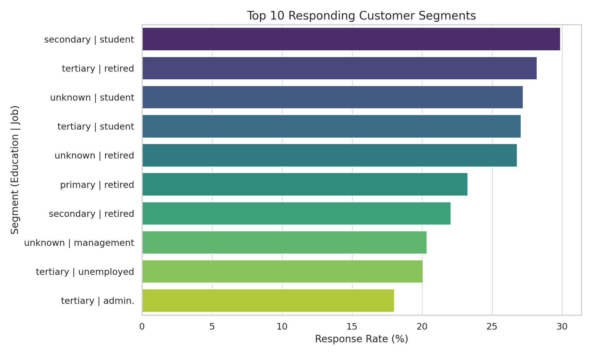
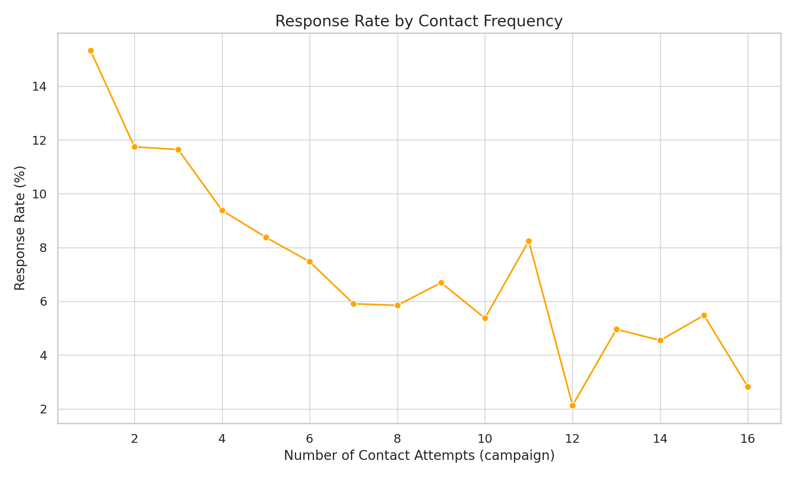
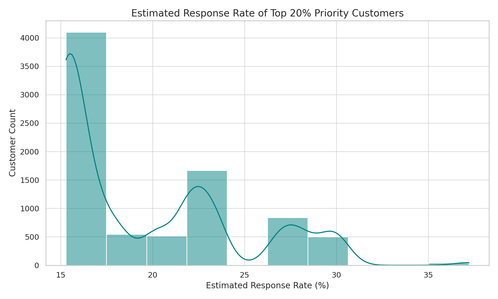

# 📬 SMS Campaign Response Analysis (Bank Marketing Simulation)

**Author:** Jeremy Gutierrez  
**Tools Used:** SQL (MySQL), Python, Seaborn/Matplotlib, Power BI-ready structure  
**Project Type:** Data Analyst Portfolio  
**Target Role:** AI-Powered Data Analyst at Drips  
**Dataset Source:** UCI Bank Marketing Dataset ([link](https://archive.ics.uci.edu/ml/datasets/bank+marketing))

---

## 🧠 Project Overview

This project simulates the analysis of an SMS outreach campaign to banking customers, modeled after real-world use cases at companies like **Drips**.

The goal is to extract **actionable business insights** using SQL and data visualization, based on historical campaign performance, customer demographics, and behavior patterns.

---

## 📊 Business Questions

1. **Which customer segments respond best to SMS outreach messages?**
2. **How does the timing or frequency of contact affect conversion rate?**
3. **If we can only reach 20% of leads, who should we prioritize?**

---

## 💾 Dataset Description

The original dataset was cleaned by removing duplicates, nulls, and outliers. Final dataset: [`/data/bank_cleaned_final.csv`](./data/bank_cleaned_final.csv)

| Column         | Description                              |
|----------------|------------------------------------------|
| `age`          | Age of client (18–95)                    |
| `job`          | Job type (admin, blue-collar, etc.)      |
| `marital`      | Marital status                           |
| `education`    | Education level                          |
| `balance`      | Bank account balance                     |
| `housing`      | Has housing loan?                        |
| `loan`         | Has personal loan?                       |
| `contact`      | Contact communication type               |
| `campaign`     | Number of contacts during this campaign  |
| `duration`     | Call duration in seconds (filtered > 0)  |
| `pdays`        | Days since last contact                  |
| `previous`     | Number of previous contacts              |
| `poutcome`     | Outcome of previous campaign             |
| `subscribed`   | Did they subscribe? (yes/no)             |

---

## 🧮 SQL Code (MySQL Dialect)

SQL scripts used in this project are stored in the `/sql` folder.

### 📁 Place this content in `/sql/q1_segment_response.sql`
```sql
SELECT
  education,
  job,
  COUNT(*) AS total_contacts,
  SUM(CASE WHEN subscribed = 'yes' THEN 1 ELSE 0 END) AS total_responses,
  ROUND(SUM(CASE WHEN subscribed = 'yes' THEN 1 ELSE 0 END) / COUNT(*) * 100, 2) AS response_rate_pct
FROM sms_campaign
GROUP BY education, job
HAVING total_contacts >= 50
ORDER BY response_rate_pct DESC
LIMIT 10;
```

### 📁 Place this content in `/sql/q2_contact_frequency.sql`
```sql
SELECT
  campaign,
  COUNT(*) AS total_contacts,
  SUM(CASE WHEN subscribed = 'yes' THEN 1 ELSE 0 END) AS total_responses,
  ROUND(SUM(CASE WHEN subscribed = 'yes' THEN 1 ELSE 0 END) / COUNT(*) * 100, 2) AS response_rate_pct
FROM sms_campaign
GROUP BY campaign
ORDER BY campaign;
```

### 📁 Place this content in `/sql/q3_top_20_percent.sql`
```sql
WITH segment_rates AS (
  SELECT
    education,
    job,
    ROUND(SUM(CASE WHEN subscribed = 'yes' THEN 1 ELSE 0 END) / COUNT(*) * 100, 2) AS seg_response_rate
  FROM sms_campaign
  GROUP BY education, job
),
scored AS (
  SELECT
    sc.*,
    sr.seg_response_rate
  FROM sms_campaign sc
  JOIN segment_rates sr
    ON sc.education = sr.education
   AND sc.job = sr.job
)
SELECT
  age,
  job,
  education,
  balance,
  seg_response_rate AS estimated_response_pct
FROM scored
ORDER BY estimated_response_pct DESC, balance DESC
LIMIT CEIL((SELECT COUNT(*) FROM sms_campaign) * 0.20);
```

---

## 📈 Visualizations

Place all images in `/visualizations/` and reference them like this:

### 1. Top Responding Customer Segments


### 2. Response Rate by Contact Frequency


### 3. Top 20% Priority Customers


---

## ✅ Skills Demonstrated

- Data cleaning and preprocessing (nulls, outliers, duplicates)
- SQL for segmentation, prioritization, and KPI analysis
- Visual storytelling with Seaborn/Matplotlib
- Real-world business question framing
- Structuring reproducible projects for GitHub

---

## 📦 Project Structure

```
sms-campaign-analysis/
│
├── README.md
├── data/
│   └── bank_cleaned_final.csv
├── sql/
│   ├── q1_segment_response.sql
│   ├── q2_contact_frequency.sql
│   └── q3_top_20_percent.sql
├── visualizations/
│   ├── q1_segment_response_rate.png
│   ├── q2_contact_frequency.png
│   └── q3_priority_response_distribution.png
└── notebooks/ (optional)
    └── sms_analysis.ipynb
```

---

## 📬 Contact

Feel free to connect or message me:
- LinkedIn: [Jeremy Gutierrez](#)
- Email: your@email.com
